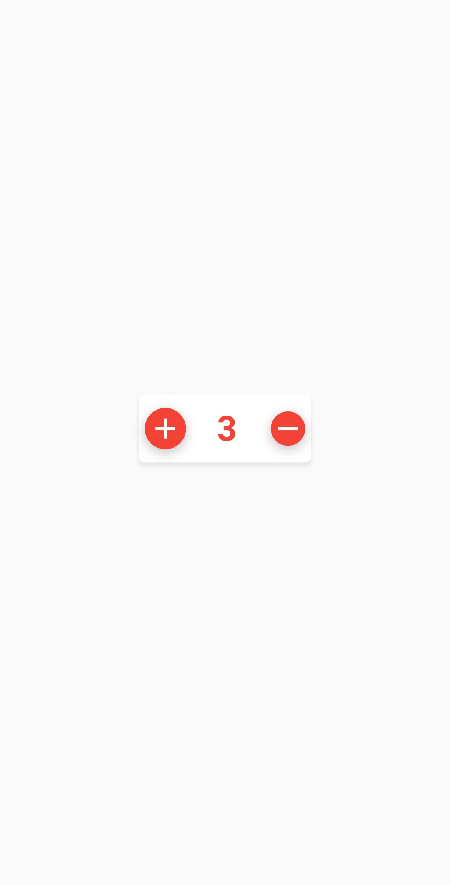

# cart_counter

A Flutter Package which Helps you can Implement Cart Counter in your flutter project. Its really Simple and Easy to use. This Package will provide me a default design and if you want to change according to you then you can also do this. In This Package you can enable TextField for custom Enter value. simple in CartCounter widget you need to pass isEnable paramter true like: isEnable:true then you'll able to Enter custom value.

## Screenshots



## Usage
[Example](https://github.com/chandan123-pradhan/cart_counter/blob/main/example/main.dart)

To use this package:

* add the dependency to your [pubspec.yaml](https://github.com/chandan123-pradhan/cart_counter/blob/main/pubspec.yaml) file.

```yaml
    dependencies:
      flutter:
        sdk: flutter
      cart_counter: ^0.0.1
```

### How to use

```dart
  
import 'package:cart_counter/Widgets/CartCounter.dart';
import 'package:flutter/material.dart';

void main() {
  runApp(MyApp());
}

class MyApp extends StatelessWidget {
  @override
  Widget build(BuildContext context) {
    return MaterialApp(
        debugShowCheckedModeBanner: false,
        title: 'Cart Counter',
        theme: ThemeData(
          primarySwatch: Colors.blue,
        ),
        home: HomePage());
  }
}

class HomePage extends StatelessWidget {
  @override
  Widget build(BuildContext context) {
    return Scaffold(
        body: Container(
      height: double.infinity,
      child: Center(
        child: Column(
          mainAxisAlignment: MainAxisAlignment.center,
          crossAxisAlignment: CrossAxisAlignment.center,
          children: [
           Container(
              width: 150,
              child: CartCounter(
                maximumValue: 10,
                minimumValue: 3,
                value: 3,
                style: TextStyle(
                    color: Colors.red,
                    fontSize: 30,
                    fontWeight: FontWeight.bold),
               onChanged: (val) {
                  //here in val variable you'll get updated counter value.
                  print(val);
                },
              ),
            ),
          ],
        ),
      ),
    ));
  }
}


```

## Done Thank You For The Using This Package. It Will Be Really Really Helpfull.
